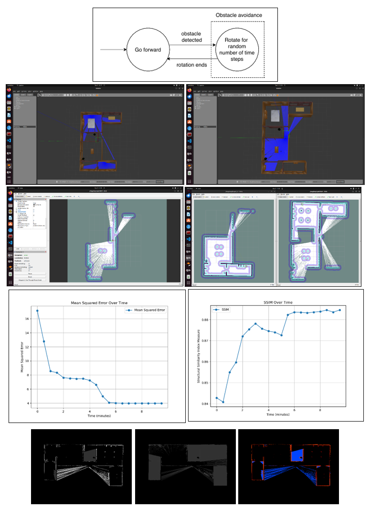

# Multi-Robot Collaborative Mapping and Exploration

## Introduction

This project presents a state-of-the-art multi-robot system for **collaborative exploration**, **mapping**, and **3D scene reconstruction** in complex, dynamic environments. Our framework integrates advanced sensor fusion, SLAM, decentralized coordination, and rigorous control theory. Each robot is equipped with high-precision LiDAR, 2D TOF cameras, and additional sensors to provide robust situational awareness and high-accuracy mapping. The system leverages classical control techniques, such as PID control and differential drive kinematics, alongside modern methodologies including Reinforcement Learning (RL) and swarm intelligence, to enable adaptive, intelligent behavior.

---


## System Overview

### Multi-Robot and Swarm Robotics

- **Collaborative Exploration & Mapping:**  
  Each robot autonomously constructs a local occupancy grid map from sensor data. These local maps are registered and fused into a global map using iterative registration (ICP-like methods) and pose graph optimization. This fusion process minimizes drift and aligns overlapping maps for global consistency.

- **Decentralized Communication:**  
  Using a ROS2 multi-master architecture, robots exchange sensor data, local maps, and control signals in real time. The decentralized framework supports dynamic role assignments (e.g., leader/follower) and robust task allocation using auction-based or consensus protocols.

- **Formation Control:**  
  Formation control is implemented through consensus algorithms and potential field methods. These methods enable coordinated motion and task execution, ensuring that robots maintain desired relative positions while navigating complex environments.

---

## Technical Methodologies

### Robotics, SLAM, and Control Systems

#### 1. Sensor Fusion & Perception

- **Multi-Sensor Integration:**  
  Data from LiDAR, TOF cameras, and IMUs is fused using pre-computed transformation matrices obtained from rigorous calibration routines. Filtering techniques, such as voxel grid filtering, are applied to remove noise and outliers from point clouds and depth maps.

- **Perception Pipeline:**  
  The system processes raw sensor inputs to generate robust estimates of the environment. This includes extracting key features, associating measurements with environmental landmarks, and updating probabilistic occupancy grids.

#### 2. SLAM and Graph Optimization

- **Local Mapping:**  
  Each robot continuously updates its occupancy grid using Bayesian updates that merge prior knowledge with new sensor data. This probabilistic approach accounts for sensor noise and dynamic environmental changes.

- **Pose Graph Optimization:**  
  Local pose graphs are built by representing robot poses as nodes and inter-scan measurements as edges. A global nonlinear optimization minimizes the error across all pose constraints, thus reducing drift and ensuring consistency of the global map.

#### 3. Differential Drive and Motion Control

- **Differential Drive Kinematics:**  
  Each robot is configured with a differential drive mechanism. The kinematic model defines the relationship between wheel velocities and the robot’s linear and angular motion. Specifically, the forward velocity (v) and rotational velocity (ω) are determined by:
  - **v = (R/2) * (w_r + w_l)**  
    where R is the wheel radius, and w_r and w_l are the right and left wheel angular velocities, respectively.
  - **ω = (R/L) * (w_r - w_l)**  
    where L is the distance between the wheels.
  
- **PID and Advanced Motion Control:**  
  A PID controller minimizes the error between the desired and actual trajectories. The controller’s output is based on proportional, integral, and derivative terms that regulate the differential drive motors to achieve smooth velocity and direction adjustments. Path planning algorithms (e.g., Hybrid-A*) compute feasible, obstacle-aware trajectories, while cubic spline interpolation is applied to smooth these paths.

- **Reactive Obstacle Avoidance:**  
  Potential field methods compute repulsive forces from nearby obstacles and attractive forces toward navigation goals. The resulting force vector is integrated into the control law, ensuring dynamic, collision-free navigation.

#### 4. Performance Metrics

- **Mapping Accuracy:**  
  Quantitative metrics such as the mean squared error (MSE) between the generated occupancy grid and a ground-truth map are used to evaluate mapping accuracy. The system also tracks convergence rates and error reduction over time.

- **Trajectory Tracking Error:**  
  The deviation between planned and executed paths is measured using root-mean-square error (RMSE) metrics. These metrics provide insights into the stability and precision of the PID controllers and path smoothing algorithms.

- **Coverage Efficiency:**  
  The percentage of the environment explored over time is computed by analyzing the occupancy grid. This metric assesses the effectiveness of the exploration strategy and the overall efficiency of the multi-robot system.

- **Control Response Metrics:**  
  Dynamic responses, such as settling time, overshoot, and steady-state error, are monitored for the PID controllers. These metrics are critical for ensuring that differential drive actuators respond accurately to control commands.

---

## Software Architecture

- **ROS2-Based Middleware:**  
  The system is built on a modular ROS2 architecture. Dedicated nodes handle sensor acquisition, data processing, control, and inter-robot communication. Synchronized `tf` transforms maintain consistent coordinate frames, while simulation environments (Gazebo) and visualization tools (RViz) are used for debugging and performance evaluation.

- **Advanced Data Processing:**  
  The SLAM modules incorporate advanced algorithms for feature extraction and environmental modeling. Experimental integration of machine learning techniques is underway to further improve robustness under varying conditions.

---

## Electronics and Embedded Systems

- **Sensor Integration and Calibration:**  
  High-speed sensor data is synchronized using precise calibration routines. Transformation matrices, computed during calibration, align data from LiDAR, TOF, and IMU sensors into a common reference frame.

- **Real-Time Control and Power Management:**  
  Custom-designed electronics manage high-frequency control loops and sensor data processing. Embedded controllers execute PID loops to regulate differential drive motors, while dedicated circuits monitor battery levels, regulate voltage, and manage thermal loads to ensure reliable operation during extended missions.

---

## Mechanical Design and Structural Analysis

- **Rapid Prototyping and Finite Element Analysis (FEA):**  
  The robot chassis and structural components are designed using CAD/CAM tools and fabricated via 3D printing. FEA simulations are performed to verify structural integrity under expected dynamic loads, ensuring that components can withstand shocks, vibrations, and impacts.

- **Composite Materials and Aerodynamics:**  
  The design utilizes lightweight composite materials to achieve a high strength-to-weight ratio. Aerodynamic profiling and careful center-of-gravity placement are implemented to enhance stability, maneuverability, and energy efficiency during high-speed maneuvers.

---

## Detailed Framework Explanation

### 1. Concepts and Methods

#### Multi-Robot Systems & Swarm Robotics

- **Distributed SLAM:**  
  Each robot employs a Bayesian update mechanism to refine its local occupancy grid using prior probabilities and new sensor measurements. Local maps are aligned using iterative registration techniques and merged via pose graph optimization to produce a coherent global map.

- **Decentralized Coordination:**  
  Communication is facilitated via ROS2 topics, with dynamic role assignment using auction-based or consensus methods. These strategies enable efficient task allocation, formation control, and coordinated navigation without a centralized controller.

#### Robotics, SLAM, and Control Systems

- **Sensor Fusion & SLAM:**  
  Sensor data is pre-processed for noise reduction and aligned using pre-computed transformation matrices. Sequential scan matching improves the relative alignment of sensor frames, while global optimization ensures consistency across the entire map.

- **Differential Drive & Motion Control:**  
  The differential drive mechanism, governed by its kinematic equations, is integrated with a PID control loop to drive the motors. This ensures accurate execution of planned trajectories. Reactive control strategies combine outputs from the PID controller with potential field adjustments to account for obstacles and dynamic changes.

- **Control System Metrics:**  
  Detailed measurements include trajectory tracking error, control response times, and mapping accuracy (evaluated via MSE and RMSE metrics). These metrics are used to tune the control parameters and validate system performance.

### 2. Step-by-Step Working of the Framework

#### 2.1 Initialization and Calibration

1. **ROS2 Node Deployment:**  
   - Each robot launches dedicated ROS2 nodes for sensor capture, data processing, control, and inter-robot communication.  
   - Nodes register within a multi-master network, ensuring decentralized control and real-time data sharing.

2. **Sensor Calibration:**  
   - A combination of static and dynamic calibration routines aligns LiDAR, TOF, and IMU sensors into a common coordinate system using transformation matrices that include both rotation and translation components.

3. **Role Assignment:**  
   - Dynamic role assignment algorithms (e.g., auction-based methods) allocate roles based on sensor quality and mapping performance, designating a “leader” for local map fusion and “support” roles for additional coverage.

#### 2.2 Local Sensing, Perception, and Mapping

1. **Data Acquisition:**  
   - Robots continuously capture sensor data (e.g., 3D point clouds, 2D depth maps, inertial measurements) at high frequencies.  
   - Pre-processing steps (e.g., voxel grid filtering) reduce noise and prepare data for further analysis.

2. **Local Mapping:**  
   - Occupancy grids are updated using Bayesian probability models that combine prior knowledge with incoming sensor data.  
   - Successive sensor frames are aligned using scan matching, and a local pose graph is maintained to track relative transformations between frames.

#### 2.3 Communication and Global Map Fusion

1. **Inter-Robot Data Exchange:**  
   - Local maps, robot poses, and associated metadata are published to ROS2 topics. Timestamp synchronization ensures that data from different robots is consistent and temporally aligned.

2. **Global Map Construction:**  
   - A dedicated map-merge module collects local maps and transforms them into a common global frame using the computed transformation matrices.  
   - A global pose graph is optimized to merge overlapping regions and eliminate inconsistencies, resulting in a high-fidelity global map.

#### 2.4 Motion Control and Navigation

1. **Trajectory Planning:**  
   - Collision-free paths are computed using the Hybrid-A* algorithm, which accounts for obstacles and dynamic constraints. Like ballistic motion.  
   - Cubic spline interpolation smooths the computed trajectory to ensure continuity, reducing abrupt changes in velocity or direction.

2. **Differential Drive Control:**  
   - The differential drive kinematics model is used to convert desired trajectory commands into individual wheel velocities.  
   - A PID controller continuously adjusts these wheel velocities based on the error between the desired trajectory and the actual movement, ensuring accurate path tracking.

3. **Reactive Obstacle Avoidance:**  
   - Potential field methods compute repulsive forces from obstacles and attractive forces toward the goal.  
   - These forces are combined with the PID output to modulate the differential drive commands in real time, providing a reactive response to dynamic obstacles.

#### 2.5 Adaptive Behavior and Map Refinement

1. **Stochastic Re-Planning:**  
   - In environments with complex obstacles, robots execute randomized rotational maneuvers in addition to deterministic controls to escape local minima and enhance exploration.

2. **Iterative Map Update:**  
   - Continuous sensor data triggers periodic re-optimization of both local and global pose graphs.  
   - This iterative process refines the occupancy grids and reduces mapping errors, as measured by mapping accuracy metrics (e.g., MSE).

#### 2.6 Performance Metrics

- **Mapping Accuracy:**  
  - Evaluated by comparing the generated occupancy grid with a ground-truth map.  
  - Mean squared error (MSE) and convergence rates are tracked to assess the accuracy of the SLAM process.

- **Trajectory Tracking Error:**  
  - Root-mean-square error (RMSE) between planned and actual trajectories is computed.  
  - Metrics include settling time, overshoot, and steady-state error, providing insight into the performance of the PID controller and differential drive system.

- **Coverage Efficiency:**  
  - The percentage of the environment explored over time is measured by analyzing updates in the occupancy grid.  
  - This metric indicates how effectively the robots are covering the search area.

- **Control Response Metrics:**  
  - Metrics such as response time, settling time, and stability of control loops are continuously monitored to ensure robust performance.

---

## Future Work

### 3. Future Work and Reinforcement Learning Integration

#### 3.1 Reinforcement Learning (RL) for Adaptive Navigation and Task Allocation

- **Action Space Expansion:**  
  Extend the control framework to incorporate adaptive speed control, dynamic goal switching, and advanced environmental interaction. This expanded action space will enable robots to learn complex behaviors suited to various mission requirements.

- **Reward Function Design:**  
  Develop a multi-objective reward structure that balances exploration (maximizing coverage), collision avoidance, and energy efficiency. The reward function will penalize unsafe actions while promoting efficient and effective navigation.

- **RL Algorithms and Training:**  
  Employ multi-agent RL algorithms such as Multi-Agent Proximal Policy Optimization (MAPPO) to learn decentralized policies in simulation environments (e.g., Gazebo). The training process will iteratively refine policies using performance metrics derived from mapping accuracy, trajectory tracking error, and coverage efficiency.

- **Policy Transfer and Real-World Adaptation:**  
  Use techniques such as domain randomization and online fine-tuning to transfer learned policies from simulation to physical robots. This hybrid approach will ensure robustness and adaptability under varying environmental conditions.

#### 3.2 Expanded Swarm, Perception, and Physical Implementation

- **Advanced Coordination:**  
  Further develop consensus algorithms for dynamic formation control and distributed task allocation. This will improve the system's ability to perform complex tasks such as cooperative object manipulation and large-scale environmental mapping.

- **Enhanced Sensor Fusion:**  
  Integrate deep learning models for real-time object detection and semantic segmentation to improve the fidelity of SLAM and mapping in challenging scenarios.

- **Physical Implementation:**  
  - **Hardware Upgrades:** Future work will focus on integrating custom PCBs, enhanced power management systems, and advanced sensor suites to improve overall system performance and reliability in real-world conditions.  
  - **Field Trials:** Conduct extensive field trials in diverse environments (urban, industrial, and natural terrains) to validate system performance, focusing on real-time mapping accuracy, robust differential drive control, and energy efficiency.  
  - **Human-Robot Collaboration:** Develop intuitive user interfaces and robust communication protocols to facilitate seamless collaboration between human operators and autonomous robots. This will be particularly important for applications such as disaster response, industrial inspections, and environmental monitoring.

---

**Summary**  
This README provides an in-depth, technically detailed explanation of our multi-robot collaborative mapping framework. It covers the key concepts and methodologies, the detailed step-by-step operational workflow—including differential drive kinematics and advanced control strategies—and outlines comprehensive performance metrics. Additionally, the future work section discusses the integration of reinforcement learning and physical implementation strategies aimed at enhancing system robustness, scalability, and real-world applicability. Our goal is to bridge advanced theoretical research with practical, deployable solutions for autonomous multi-robot exploration and mapping.


Now how to run:
## Prerequisites
- ROS2 installed (tested with ROS2 Humble/Foxy)
- TurtleBot3 simulation dependencies installed
- A properly configured ROS2 workspace (`<ros2_ws>`)

## Installation

1. Navigate to your workspace source directory:
    ```bash
    cd <ros2_ws>/src
    ```

2. Clone the repository:
    ```bash
   https://github.com/Ashish-Paka/Multi-Robot_Systems_CollaborativeMapping.git
    ```

3. Build the workspace:
    ```bash
    cd <ros2_ws>
    colcon build --symlink-install
    ```
    If you encounter any errors, try building again:
    ```bash
    colcon build --symlink-install
    ```

## Running the Package

### Step 1: Launch the Simulation
Open a terminal and run the following commands to launch the multi-robot simulation with SLAM:
```bash
export TURTLEBOT3_MODEL=waffle
export GAZEBO_MODEL_PATH=$GAZEBO_MODEL_PATH:/opt/ros/${ROS_DISTRO}/share/turtlebot3_gazebo/models
source <ros2_ws>/install/setup.bash
ros2 launch multirobot_map_merge multi_tb3_simulation_launch.py slam_gmapping:=True
```
### Step 2: Start Random Walk Exploration
In a second terminal, source the workspace and start the random walk exploration node for robot 1:
```bash
source <ros2_ws>/install/setup.bash
ros2 run multi_robot_explore multi_robot_random_walk_robot1 --ros-args --params-file ./src/multi_robot_explore/config/robot_params.yaml
```
Open third terminal, source the workspace and start the random walk exploration node for robot 2:
```bash
source <ros2_ws>/install/setup.bash
ros2 run multi_robot_explore multi_robot_random_walk_robot2 --ros-args --params-file ./src/multi_robot_explore/config/robot_params.yaml
```

### Step 3: Launch the Map Merge Node
In a forth terminal, launch the map merge node to combine the maps from multiple robots:
```bash
ros2 launch multirobot_map_merge map_merge.launch.py
```

### Step 4: Visualize in RViz

In a fivth terminal, launch RViz for visualization:
```bash
rviz2 -d <ros2_ws>/src/m-explore-ros2/map_merge/launch/map_merge.rviz
```


### Please find the attached reports and documents in the docs folder. Thanks to my partners Vedant C and Akshay Mahalle.
